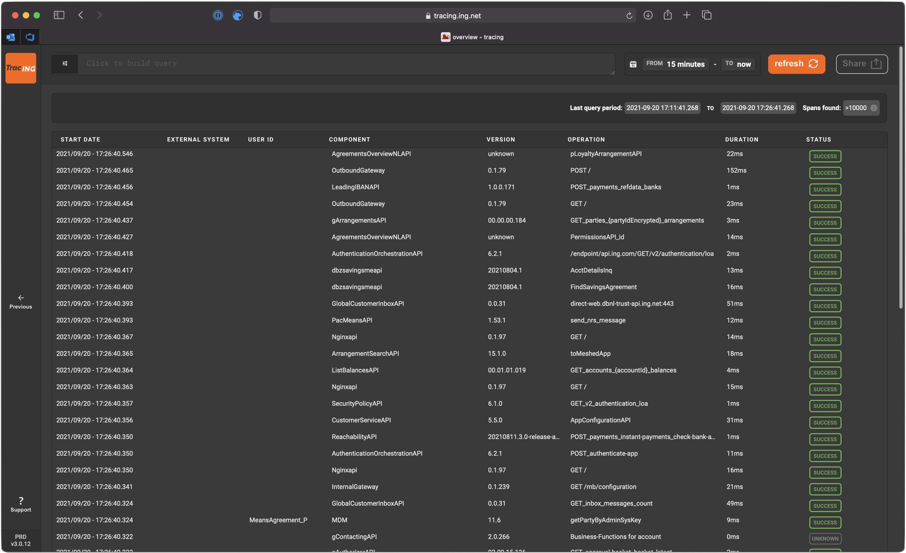

<!-- _class: cover -->


# TracING 2.0
## Our evolution to Open Telemetry with Grafana Tempo

<!--
Vragen:
 - Wie gebruikt er tracing?
 - ...
-->
---


# About me

```yaml
Name: Vincent Free
Title: Engineer V
Tribe: GITEO
Age: 36
Experience:
  - Golang
  - Kotlin / Java
  - Containerization(k8s, swarm)
  - Observability
```
<!--
GITEO: Global IT Engineering & Operations
-->
---
<!-- _class: demo -->

# Distributed Tracing

---

# Distributed Tracing - What is a trace?


---
<!-- _class: center_img -->
# Distributed Tracing - What is span context?


<!--
The Span Context consists of a TraceID, SpanID and TraceFlags.

type SpanContext struct {
	traceID    TraceID [16]byte
	spanID     SpanID [8]byte
	traceFlags TraceFlags byte
}

-->

---
<!-- _class: demo -->

# Current TracING

---

# Current TracING

- Started out as a Tibco library
- Current version was created in **2017**


<!-- 
TracING started out as a Tibco specific library, It evolved into the current JVM based product in 2017. 
-->

<!--
This makes the current version 6 years old(the previous version redates my involvement with the product).
-->

---

# Current TracING



---

# Current TracING


---

# Current TracING


---

# Current TracING


---
<!-- _class: demo -->

# Nextgen TracING


---

# Nextgen TracING

<br/>

> If everything is working fine, why change?

<!-- <br/> -->

- Deprecated standard
- Database query speed
- Maintenance
  - Dependency on expertise
- MDPL grand vision on observability

<!--  -->


---

# Nextgen TracING - Monitoring data pipeline (MDPL)


<!--
The MDPL consists of 4 pillars, Collection, Processing, Delivery and Foundation

Collection is self explanatory, this pillar concerns itself with gathering all observability signals like traces but also metrics and logs.

Processing is our ML meets AIOps meets transformations layer. Here we extract valuable insights out of the observability meta data.

Delivery is our presentation layer, here we show our users observability data through grafana but also the derived insights from processing and we also offer services like IAT, eReporter and SLIM whom are now called SLING( for more on this service my colleague Evert-Jan van Doorn has a talk at 2:45 in building Blocks)

Foundation is the glue that holds it all together, it offers the actual datastores, but also features for generic filtering, routing and authorization used by the other pillars. 
-->
---

# Nextgen TracING

> Grafana Tempo


Better image?

---

# Nextgen TracING

- Open Telemetry
- Feature rich
  - Service graph
  - Span metrics table
  - Node graph
  - TraceQL
- Known architecture
  - Grafana Mimir


<!--
example TraceQL: 
{ name = "sayHello" && duration > 300ms } && { name=~ "greet:" } | count() >=6
-->
---

# Nextgen TracING

> JVM example


Automatic application instrumentation

```shell
java -javaagent:path/to/opentelemetry-javaagent.jar -Dotel.service.name=my-service-name -jar myapp.jar

# or

export JAVA_TOOL_OPTIONS="-javaagent:path/to/opentelemetry-javaagent.jar"
export OTEL_SERVICE_NAME="your-service-name"
java -jar myapp.jar
```

- Framework support
  - Akka, **Spring**, **Kafka**, elasticsearch api client, gRPC, **Java runtime/platform**, **JAX-RS**, **Log4j/logback**, Netty, **Reactor**/RXJava, **Vert.X**, ZIO

---

# Nextgen TracING

> Example of an application implementing OpenTelemetry in Vert.X (Kotlin)

```kotlin
private fun openTelemetryConfig(version: String): OpenTelemetrySdk {
    val attributes = Attributes.builder()
        .put(AttributeKey.stringKey("squad.name"), "Cerebro")
        .put(ResourceAttributes.SERVICE_NAME, "Event-API")
        .put(ResourceAttributes.TELEMETRY_SDK_LANGUAGE, ResourceAttributes.TelemetrySdkLanguageValues.JAVA)
        .put(ResourceAttributes.SERVICE_VERSION, version)

    val tracerProvider = SdkTracerProvider.builder()
        .setResource(
            Resource.getDefault().merge(
                Resource.create(attributes.build())
            )
        )
        .addSpanProcessor(
          BatchSpanProcessor.builder(OtlpGrpcSpanExporter.builder().build()).build()
        ).build()

    return OpenTelemetrySdk.builder()
        .setTracerProvider(tracerProvider)
        .setPropagators(ContextPropagators.create(W3CTraceContextPropagator.getInstance()))
        .buildAndRegisterGlobal()
}
```

---

# Nextgen TracING

> The actual initialization for Vert.X

```kotlin
val vertxOptions = CerebroApp.vertxOptions(
        commonTags = commonTags,
        labelSet = setOf(Label.HTTP_CODE, Label.HTTP_METHOD, Label.HTTP_PATH, Label.EB_ADDRESS)
    ).apply {
        if (starterConfig.tracingActive) {
            //after this line all remote calls will be instrumented (http/grpc/eventbus/kafka etc.)
            tracingOptions = OpenTelemetryOptions(openTelemetryConfig(starterConfig.appVersion))
        }
    }

    val vertx: Vertx = Vertx.vertx(vertxOptions)
```

---

# Open Telemetry


---


# Migration phase

- Interoperability between old and new
  - update span ID's from UUID to the W3C trace-context standard
- Use the opentelemetry collector over direct Kafka connections

<!--
The old ID format was implemented before there was an official standard.
-->

- Ensure backwards compatibility with Jaeger Uber trace ID injecting/extraction 

<!--
The jaeger format was used in the old version of tracing. 
With the new environment we are using the W3C standard.
-->

---
<!-- _class: demo -->

# Demo

---
<!-- _class: questions -->

# Questions