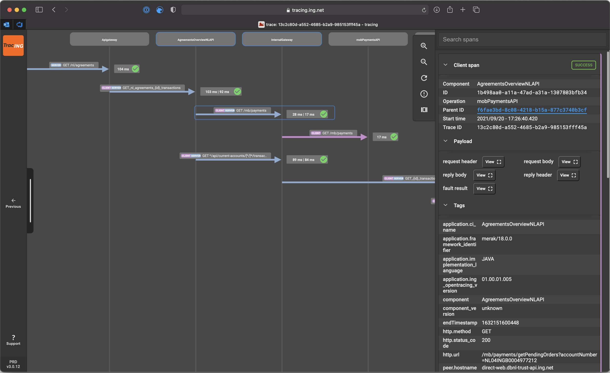
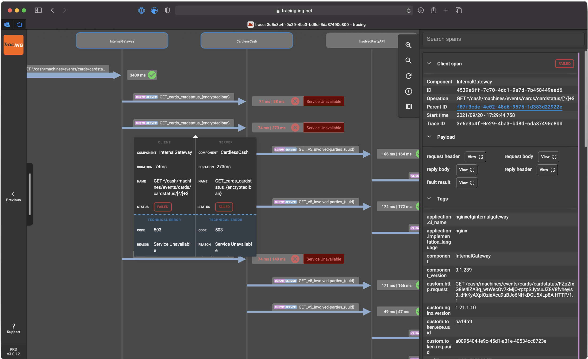

<!-- _class: cover -->


# Tracing 2.0
## Our evolution to Open Telemetry with Grafana Tempo
---


# About me

```yaml
Name: Vincent Free
Title: Engineer V
Age: 36
Experience:
  - GoLang
  - Kotlin
  - Containerization(k8s,swarm)
```

---

# Distributed Tracing

What is a trace?


---

# Distributed Tracing

What is a span context?


<!--
The Span Context consists of a TraceID, SpanID and TraceFlags.

type SpanContext struct {
	traceID    TraceID [16]byte
	spanID     SpanID [8]byte
	traceFlags TraceFlags byte
}

-->

---

# TracING @ ING

- Started out as a Tibco library
- Current version was created in **2017**



<!-- 
TracING started out as a Tibco specific library, It evolved into the current JVM based product in 2017. 
-->

<!--
This makes the current version 6 years old(the previous version redates my involvement with the product).
-->

---

# TracING @ ING


---

# TracING @ ING


---

# TracING @ ING



---

# NextGen version of TracING

Grafana Tempo


---

# NextGen version of TracING

- Open Telemetry
- Feature rich
  - Service graph
  - Metric generator
  - Node graph
  - TraceQL
- Known architecture
  - Grafana Mimir

---

# Open Telemetry


<!--  -->

---


# Migration phase

- Interoperability between old and new
  - update span ID's from UUID to the W3C trace-context standard

<!--
The old ID format was implemented before there was an official standard.
-->

- Backwards compatible with Jaeger Uber ID injecting/extraction 

<!--
The jaeger format was used in the old version of tracing. 
With the new environment we are using the W3C standard.
-->

---